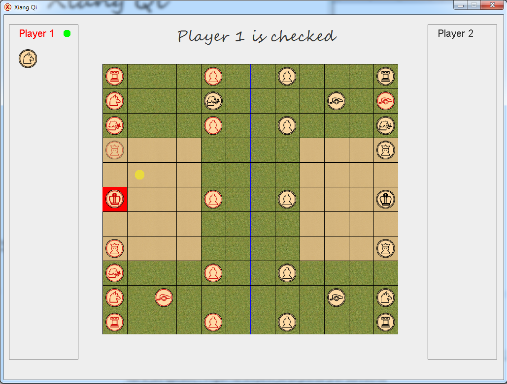

# Genie_Logiciel_XiangQi_L2S2

Ce projet a été développé dans le cadre du module "Génie Logiciel et Programmation" visant à approfondir ses connaissances en programmation orientée objet. Ce jeu est une version modifiée du jeu d'échecs chinois XiangQi. Il possède les caractéristiques suivantes:

* Interface graphique Java FX
* Possibilité de choisir un plateau de jeu
* Joueur contre joueur
* Joueur contre Ordinateur
* Plateaux de jeu, pièces et textures reprogrammables par l'utilisateur

Pour les précisions techniques, le rapport est consultable (Rapport_GLP.pdf) ainsi que le cahier des charges (spécifications).

